# Règles du Loup Garou Pour Une Nuit

## Principe du jeu

Dans ce jeu 2 équipes s'affrontent : L'**équipe des Villageois 👦** et l'**équipe des Loups-Garous 🐺**. Au début de la partie, chaque joueur reçoit une carte de rôle et la regarde avant de la poser devant lui, face cachée. La nuit tombe alors sur le village et les joueurs ferment les yeux. Durant cette nuit les différents rôle vont effectuer des actions chacun à leur tour en étant appelé par un meneur (qui peut aussi jouer !).

Une fois la nuit passée, les joueurs ouvrent les yeux mais ne regardent pas leur carte. Ils ne peuvent alors pas être sûr de leur rôle et donc de leur équipe ! Les joueurs peuvent alors discuter des évènements qui se sont déroulés pendant la nuit pour essayer de déterminer leur rôle et enfin se mettre d'accord pour voter qui doit être exécuté.
Durant la phase de discussion, tous les arguments sont autorisés. Vous pouvez donner votre rôle et dire exactement ce que vous avez fait et vu ou bien mentir sur toute la ligne.

!!! warning "Précision des règles."
    Pour la suite, ce sont les règles spécifiques au rôle qui prennent le dessus sur les règles générales expliquées.

### Le vote

Les joueurs comptent jusqu'à 3 et pointent tous du doigt n'importe quel joueur (un joueur peut voter pour lui-même). La personne qui reçoit le plus de vote est alors exécutée. En cas d'égalité, toutes les personnes ayant reçu le plus de votes sont exécutées.

### Conditions de victoire

Pour que l'**équipe des Villageois 👦** l'emporte, au moins 1 [Loup-Garou](#loups-garous) (ou [Loup Alpha](#loup-alpha)) doit mourir. Même si un membre de l'**équipe des Villageois 👦** meurt, à partir du moment où un Loup meurt, la victoire est pour l'**équipe des Villageois 👦**.

Pour que l'**équipe des Loups-Garous 🐺** gagnent, il faut donc qu'aucun [Loup-Garou](#loups-garous) ou [Loup Alpha](#loup-alpha) ne meure.

Le [Sbire](#sbire) fait partie de l'**équipe des Loups-Garous 🐺** mais n'en est pas un, il peut donc mourir et quand même remporter la partie.

Le Doppelgänger fait partie de l'équipe pour dont il a copié le rôle.

!!! warning "Rôle du [Tanneur](#tanneur)."
    Les conditions de victoire changent si vous jouez avec le [Tanneur](#tanneur).

## Ordre d'appel

Pour rappel, la personne qui fait meneur, peut aussi jouer (si il y arrive les yeux fermés évidemment).

<!-- no toc -->
1. [Marchand de Sable](#marchand-de-sable)
2. [Doppelgänger](#doppelgänger)
3. [Loups-Garous](#loups-garous)
4. [Loup Alpha](#loup-alpha)
5. [Sbire](#sbire)
6. [La Chose](#la-chose)
7. [Les Sœurs](#les-sœurs)
8. [Voyante](#voyante)
9. [Apprentie Princesse](#apprentie-princesse)
10. [Chasseur de Fantômes](#chasseur-de-fantômes)
11. [Voleur](#voleur)
12. [Sorcière](#sorcière)
13. [Noiseuse](#noiseuse)
14. [Soûlard](#soûlard)
15. [Insomniaque](#insomniaque)
16. [Divinateur](#divinateur)

!!! warning "[Doppelgänger](#doppelgänger) et [Divinateur](#divinateur)"
    Si ces 2 rôles sont présents, alors il faut ré-appeler le [Doppelgänger](#doppelgänger) après le [Divinateur](#divinateur) au cas où il aurait copié son rôle.

## Explication des rôles

### Marchand de Sable

**👦 Équipe Villageois**.

Le Marchand de Sable se réveille en premier et va toucher la main d'un autre joueur. Ce joueur ne se réveillera pas pendant la nuit, sous aucune raison.

### Doppelgänger

**👦/🐺/👞 Équipe changeante**.

Le Doppelgänger se réveille au début de la nuit et va regarder la carte d'un autre joueur pour copier son rôle. Si le rôle implique une action nocturne (autre que les [Loups-Garous](#loups-garous)), il la fait immédiatement (sauf s'il a copié le rôle du [Divinateur](#divinateur), il le fait à la toute fin).

S'il est Loup-Garou alors il se réveillera comme un Loup-Garou normal pendant leur tour.

Son équipe est celle du rôle qu'il a copié.

!!! warning "Mouvement de la carte du Doppelgänger"
    Même lorsqu'elle est déplacée, la carte du Doppelgänger garde le rôle qu'elle a copié.

### Loups-Garous

**🐺 Équipe Loups-Garous**.

Les Loups se réveillent ensemble et se reconnaissent. Ils savent alors combien ils sont et qui se trouve dans leur équipe au début de la partie.

Si un Loup se réveille et est seul, alors il a le droit de regarder une des 3 cartes faces cachées au milieu.

### Loup Alpha

**🐺 Équipe Loups-Garous**.

!!! info "Mise en place."
    Pour mettre en place le Loup Alpha il faut ajouter une carte de Loup-Garou, face cachée et tournée de 90 degrés par rapport aux 3 cartes au centre.

Le Loup Alpha se réveille en même temps que les autres [Loups-Garous](#loups-garous) mais va ensuite se réveiller au tour d'après et devra échanger la carte de Loup mise de côté avec celle de n'importe quel joueur non Loup.

Le Loup Alpha ne peut pas indiquer aux autres [Loups-Garous](#loups-garous) qu'il est l'Alpha pendant la nuit.

De la même manière que les [Loups-Garous](#loups-garous), si lorsqu'il se réveille avec les [Loups-Garous](#loups-garous) il est seul, alors il a le droit de regarder une des 3 cartes faces cachées au milieu.

### Sbire

**🐺 Équipe Loups-Garous**.

Lorsque le Sbire se réveille, tous les Loups doivent lever la main ([Loups-Garous](#loups-garous) et [Loup Alpha](#loup-alpha)). Le Sbire sait alors qui sont les Loups mais les Loups ne savent pas qu'il est leur allié.

Le Sbire faisant partie de l'**équipe des Loups-Garous 🐺** mais n'étant pas un Loup, alors s'il meurt mais qu'aucun Loup ne meure, il remporte la partie.

Si le Sbire est présent mais qu'aucun Loup n'est en jeu, alors pour gagner il faut qu'un membre de l'**équipe des Villageois 👦** meurt.

### La Chose

**👦 Équipe Villageois**.

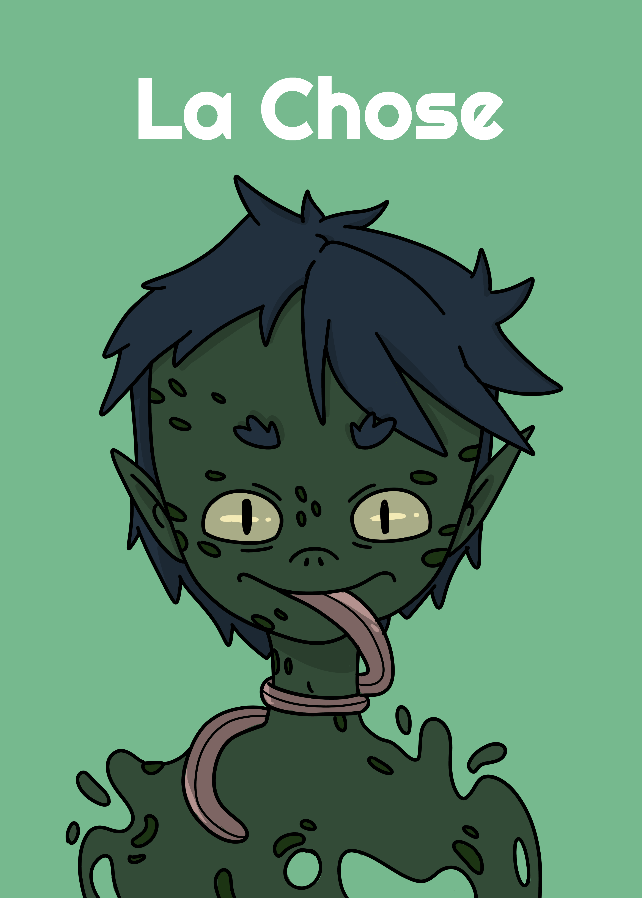

Lorsque La Chose se réveille, elle va taper sur l'épaule d'un joueur à côté d'elle. Elle doit taper sur l'épaule droite de son voisin de gauche et inversement.

### Les Sœurs

**👦 Équipe Villageois**.

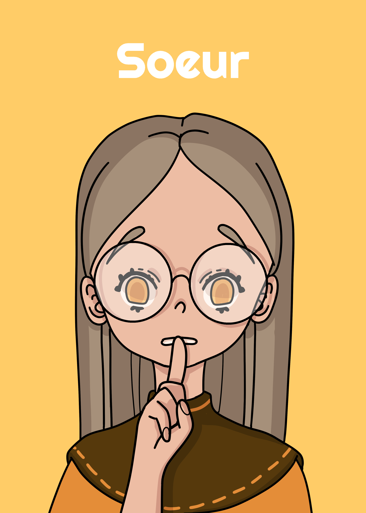

Les Sœurs se jouent toujours par 2.
Lorsque Les Sœurs sont appelées elles se réveillent et se regardent et savent qu'elles sont ensemble. Si une Sœur se réveille et est seule alors cela veut dire que l'autre carte de Sœur est au milieu.

### Voyante

**👦 Équipe Villageois**.

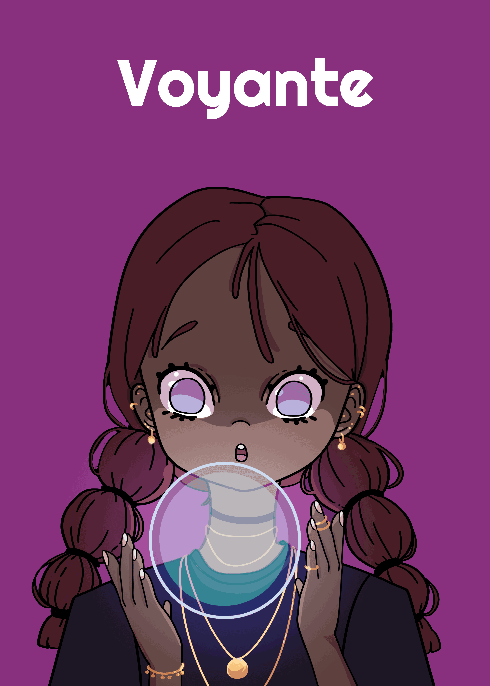

La Voyante se réveille et regarde la carte de n'importe quelle autre joueur avant de la remettre à sa place.

### Apprentie Princesse

**👦 Équipe Villageois**.

L'Apprentie Princesse se réveille et regarde une carte face cachée au milieu de la table.

### Chasseur de Fantômes

**👦/🐺/👞 Équipe changeante**.

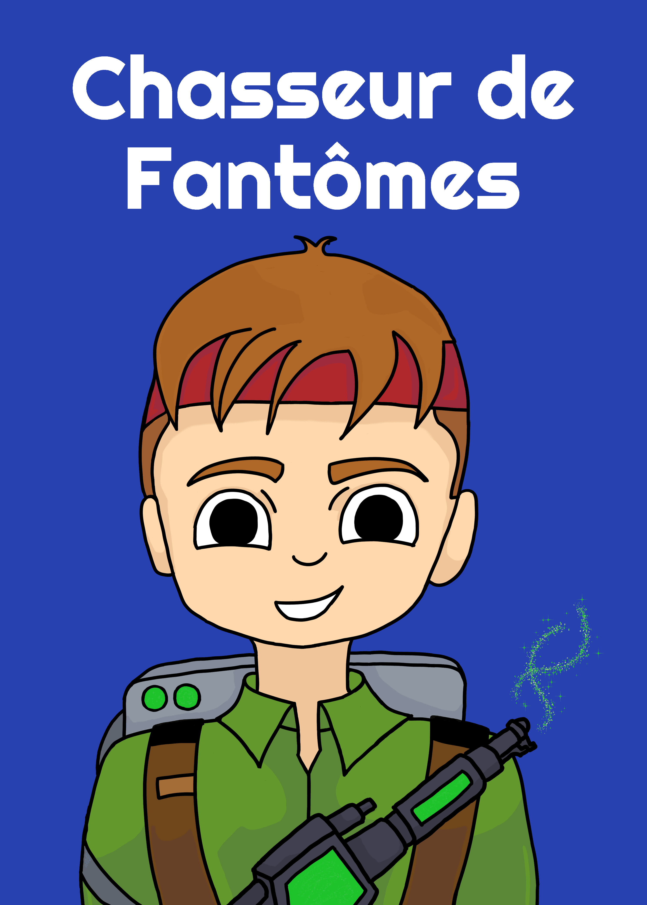

Lorsque le Chasseur de Fantômes se réveille il peut regarder jusqu'à 2 cartes d'autres joueurs, l'une après l'autre. En revanche si il découvre une carte de [Tanneur](#tanneur) ou de Loup, son tour s'arrête immédiatement et il copie le rôle du personnage, sans en copier les pouvoirs.

!!! info "Précision des règles."
     Si le chasseur de fantômes découvre le [Doppelgänger](#doppelgänger), il ne peut pas savoir quel rôle est copié, alors il l'interprète comme un simple Villageois.

### Voleur

**👦 Équipe Villageois**.

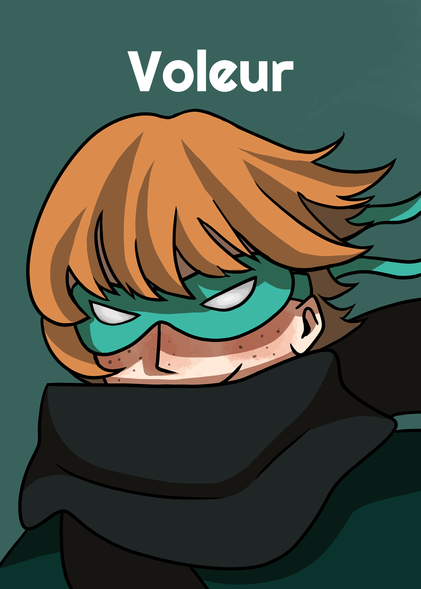

La Voleur se réveille et peut échange **sa** carte avec celle de n'importe quel autre joueur et regarde la carte qu'il vole.

### Sorcière

**👦 Équipe Villageois**.

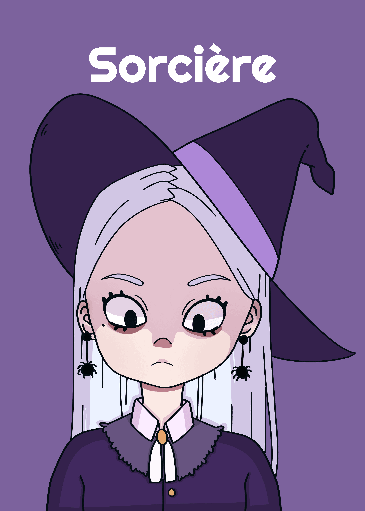

La Sorcière se réveille et peut regarder une des cartes au milieu de la table. Si elle regarde une carte au milieu, elle doit l'échanger avec celle de n'importe quel joueur (elle comprise).

### Noiseuse

**👦 Équipe Villageois**.

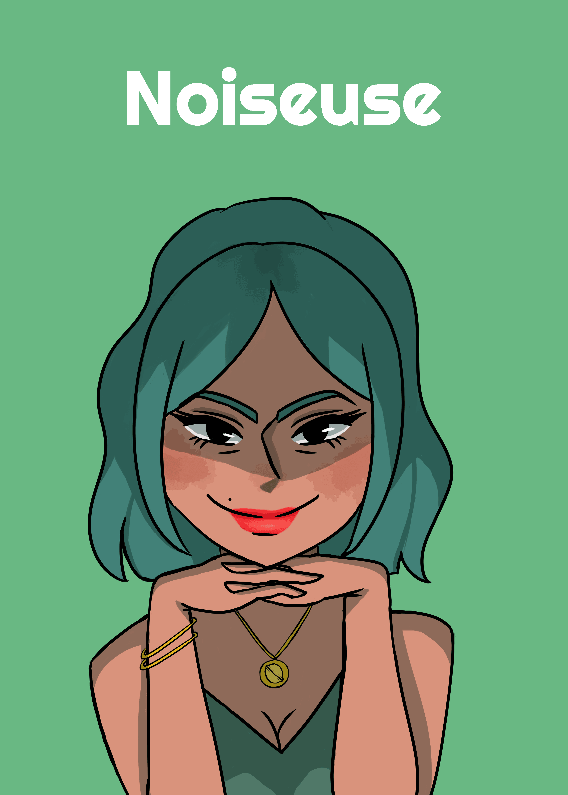

La Noiseuse se réveille et échange les cartes de 2 autres joueurs sans les regarder.

### Soûlard

**👦/🐺/👞 Équipe changeante**.

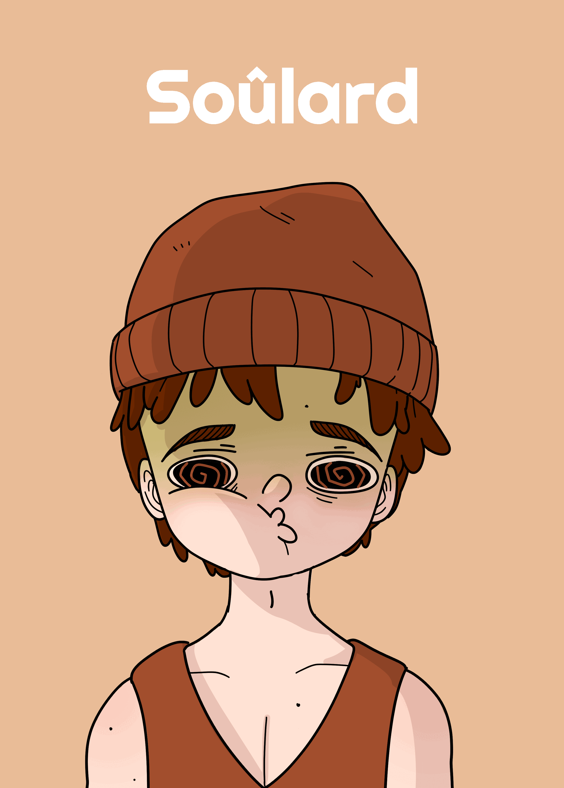

La Soûlard se réveille et échange sa carte avec une des cartes au milieu de la table sans regarder. Il ne connaît donc pas son rôle et ne sait pas à quelle équipe il fait partie.

### Insomniaque

**👦 Équipe Villageois**.

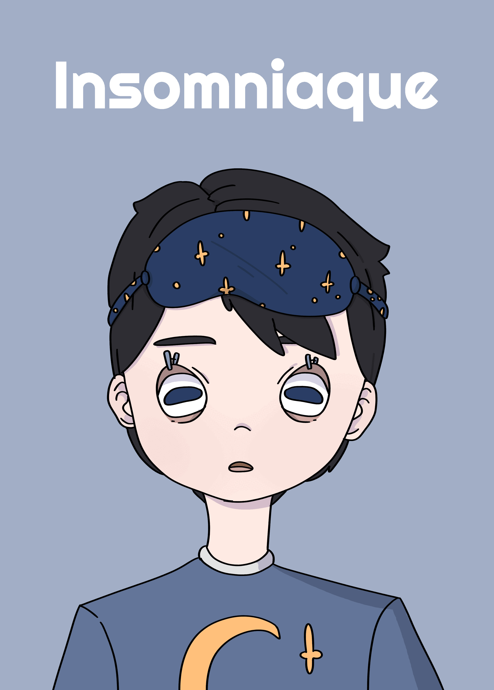

L'Insomniaque se réveille et regarde la carte devant lui. Il connaît donc son rôle au levé du jour.

### Divinateur

**👦 Équipe Villageois**.

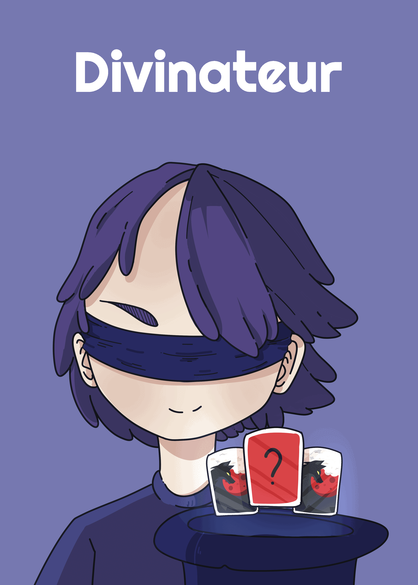

Le Divinateur se réveille et va retourner la carte de n'importe quel joueur pour qu'elle soit face visible au levé du jour. Si la carte dévoilée est une carte de Loup ou de [Tanneur](#tanneur), il la remet face cachée.

### Chasseur

**👦 Équipe Villageois**, **🌙 Ne se réveille pas**.

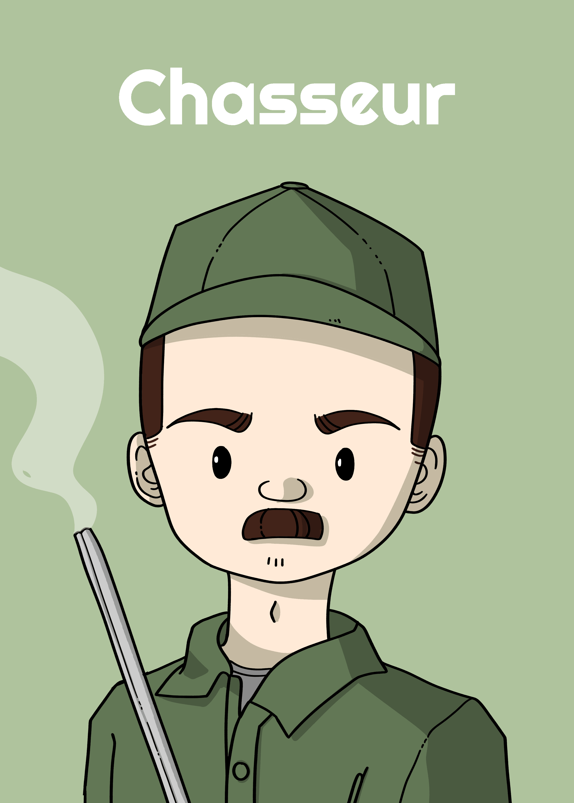

Si le Chasseur meurt, alors la personne pour laquelle il a voté meurt aussi.

### Garde

**👦 Équipe Villageois**, **🌙 Ne se réveille pas**.

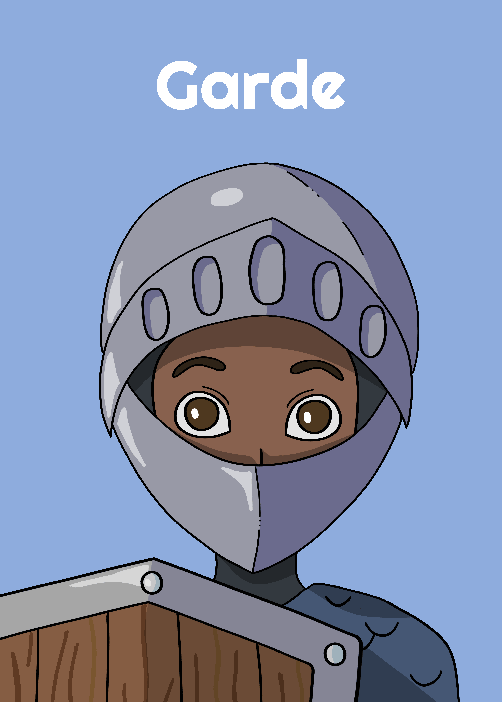

La personne pour laquelle le Garde a voté ne peut pas mourir. Si la personne protégée est celle ayant reçue le plus de vote, alors a deuxième personne ayant le plus de votes meurt si elle en a au moins 2. Sinon personne ne meurt.

### Tanneur

**👞 Équipe Tanneur**, **🌙 Ne se réveille pas**.

Le Tanneur est seul et a pour unique but de mourir lors du vote. Si il meurt et qu'un Loup meurt alors l'**équipe des Villageois 👦** a gagné, ainsi que le Tanneur. Si aucun Loup ne meurt et que la Tanneur meurt alors il est le seul à gagner.

### Pêcheur

**👦 Équipe Villageois**, **🌙 Ne se réveille pas**.

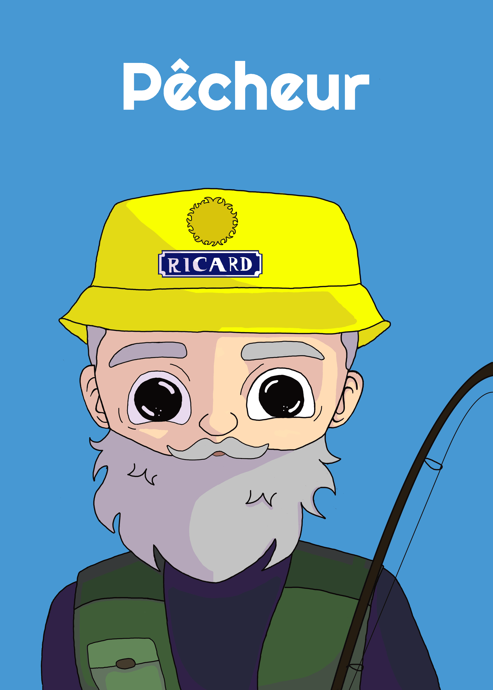

Il est mignon mais ne sert à rien, inventez lui un rôle !
