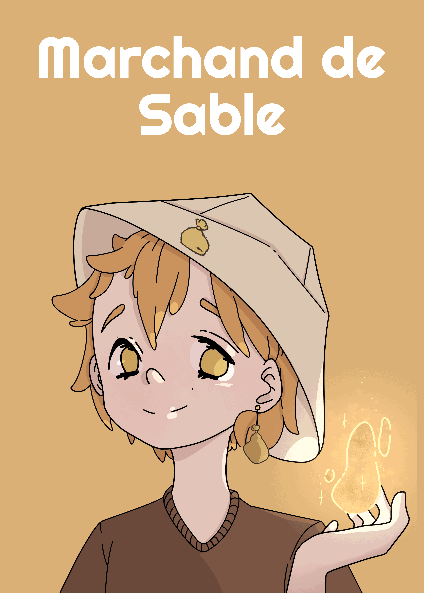
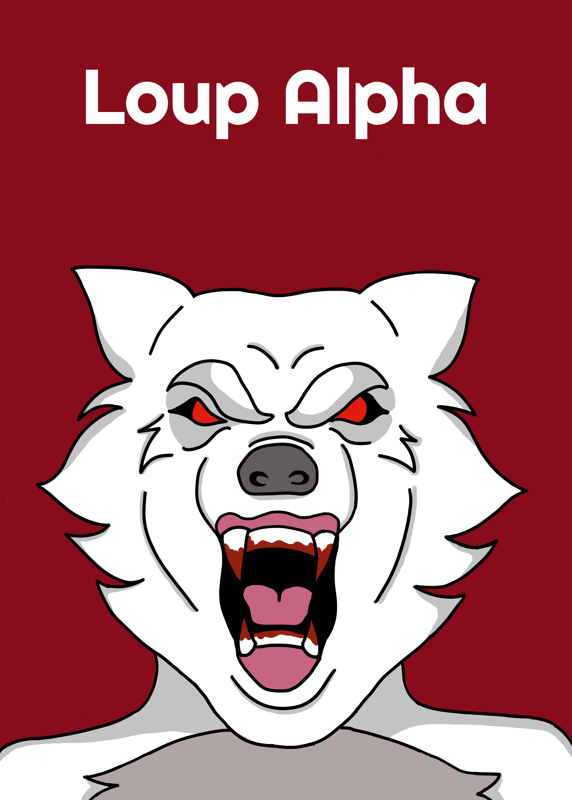
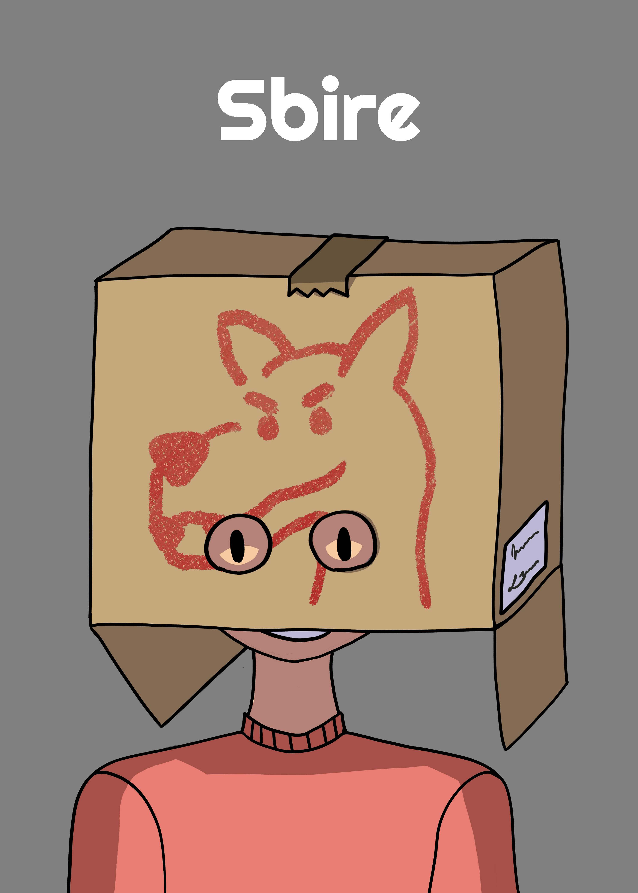
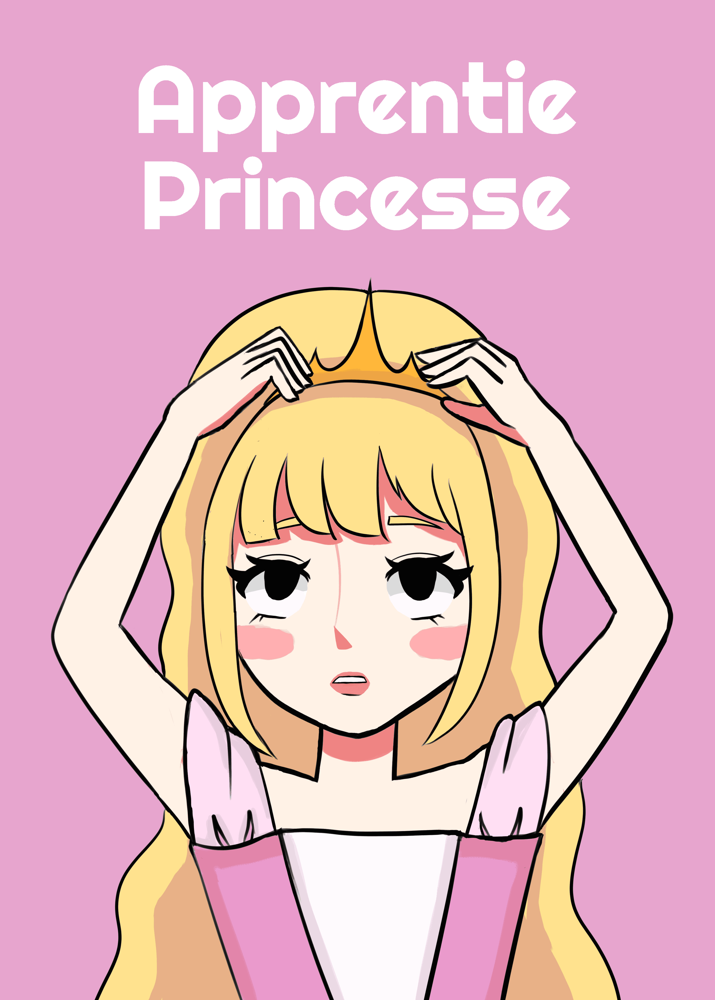
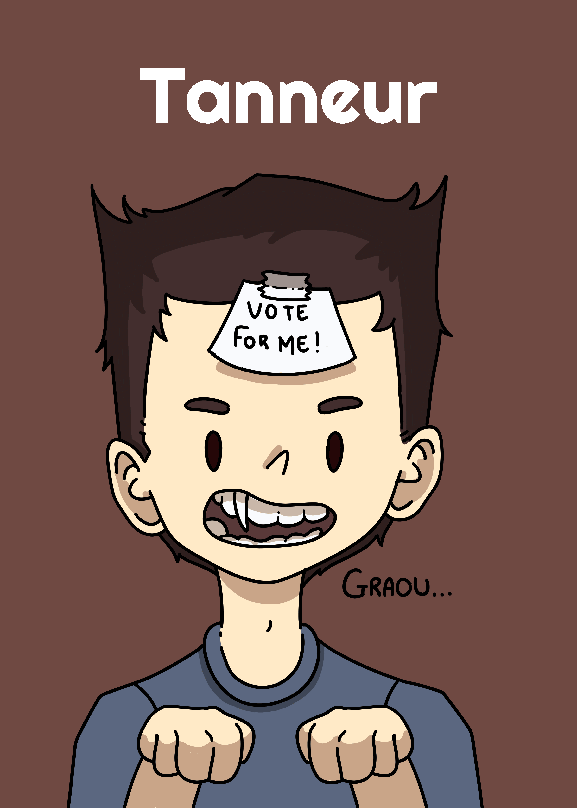

# Règles du Loup Garou Pour Une Nuit

## Principe du jeu

Dans ce jeu 2 équipes s'affrontent : L'**équipe des Villageois 👦** et l'**équipe des Loups-Garous 🐺**. Au début de la partie, chaque joueur reçoit une carte de rôle et la regarde avant de la poser devant lui, face cachée. La nuit tombe alors sur le village et les joueurs ferment les yeux. Durant cette nuit les différents rôle vont effectuer des actions chacun à leur tour en étant appelé par un meneur (qui peut aussi jouer !).

Une fois la nuit passée, les joueurs ouvrent les yeux mais ne regardent pas leur carte. Ils ne peuvent alors pas être sûr de leur rôle et donc de leur équipe ! Les joueurs peuvent alors discuter des évènements qui se sont déroulés pendant la nuit pour essayer de déterminer leur rôle et enfin se mettre d'accord pour voter qui doit être exécuté.
Durant la phase de discussion, tous les arguments sont autorisés. Vous pouvez donner votre rôle et dire exactement ce que vous avez fait et vu ou bien mentir sur toute la ligne.

!!! warning "Précision des règles."
    Pour la suite, ce sont les règles spécifiques au rôle qui prennent le dessus sur les règles générales expliquées.

### Le vote

Les joueurs comptent jusqu'à 3 et pointent tous du doigt n'importe quel joueur (un joueur peut voter pour lui-même). La personne qui reçoit le plus de vote est alors exécutée. En cas d'égalité, toutes les personnes ayant reçu le plus de votes sont exécutées.

### Conditions de victoire

Pour que l'**équipe des Villageois 👦** l'emporte, au moins 1 Loup-Garou (ou Loup Alpha) doit mourir. Même si un membre de l'**équipe des Villageois 👦** meurt, à partir du moment où un Loup-Garou meurt, la victoire est pour l'**équipe des Villageois 👦**.

Pour que l'**équipe des Loups-Garous 🐺** gagnent, il faut donc qu'aucun Loup-Garou ou Loup Alpha ne meure.

Le Sbire fait partie de l'**équipe des Loups-Garous 🐺** mais n'en est pas un, il peut donc mourir et quand même remporter la partie.

Le Doppelgänger fait partie de l'équipe pour dont il a copié le rôle.

## Explication des rôles

### Marchand de Sable

**👦 Équipe Villageois**.

Le Marchand de Sable se réveille en premier et va toucher la main d'un autre joueur. Ce joueur ne se réveillera pas pendant la nuit, sous aucune raison.

### Doppelgänger

**👦/🐺 Équipe dépendante du rôle**.

Le Doppelgänger se réveille au début de la nuit et va regarder la carte d'un autre joueur pour copier son rôle. Si le rôle implique une action nocturne (autre que les Loups-Garous), il la fait immédiatement.

S'il est Loup-Garou alors il se réveillera comme un Loup-Garou normal pendant leur tour.

Son équipe est celle du rôle qu'il a copié.

### Loups-Garous

**🐺 Équipe Loups-Garous**.

Les Loups se réveillent ensemble et se reconnaissent. Ils savent alors combien ils sont et qui se trouve dans leur équipe au début de la partie.

Si un Loup se réveille et est seul, alors il a le droit de regarder une des 3 cartes faces cachées au milieu.

### Loup Alpha

**🐺 Équipe Loups-Garous**.

!!! info "Mise en place."
    Pour mettre en place le Loup Alpha il faut ajouter une carte de Loup-Garou, face cachée et tournée de 90 degrés par rapport aux 3 cartes au centre.

Le Loup Alpha se réveille en même temps que les autres Loups-Garous mais va ensuite se réveiller au tour d'après et devra échanger la carte de Loup mise de côté avec celle de n'importe quel joueur non Loup.

Le Loup Alpha ne peut pas indiquer aux autres Loups-Garous qu'il est l'Alpha pendant la nuit.

De la même manière que les Loups-Garous, si lorsqu'il se réveille avec les Loups-Garous il est seul, alors il a le droit de regarder une des 3 cartes faces cachées au milieu.

### Sbire

**🐺 Équipe Loups-Garous**.

Lorsque le Sbire se réveille, tous les Loups doivent lever la main (Loups-Garous et Loup Alpha). Le Sbire sait alors qui sont les Loups mais les Loups ne savent pas qu'il est leur allié.

Le Sbire faisant partie de l'**équipe des Loups-Garous 🐺** mais n'étant pas un Loup, alors s'il meurt mais qu'aucun Loup ne meure, il remporte la partie.

Si le Sbire est présent mais qu'aucun Loup n'est en jeu, alors pour gagner il faut qu'un membre de l'**équipe des Villageois 👦** meurt.

### Apprentie Princesse

### Tanneur

**👞 Équipe Tanneur**.

